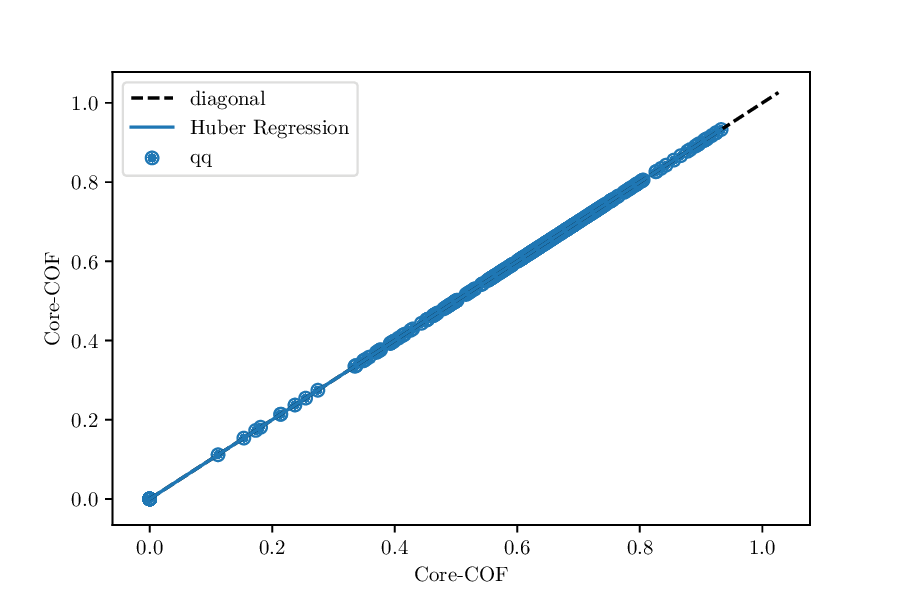
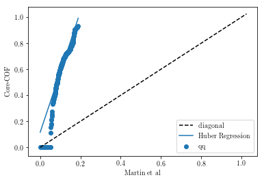

=================
Quickstart Guide
=================

Removing Duplicates
-------------------
To get the duplicates in a directory with structures, you can run something like

::

    from structure_comp.remove_duplicates import RemoveDuplicates

    rd_rmsd_graph = RemoveDuplicates.from_folder(
        '/home/kevin/structure_source/csd_mofs_rewritten/', method='rmsd_graph')

    rd_rmsd_graph.run_filtering()

The filenames and the number of duplicates are saved as attributes of the :code:`RemoveDuplicates`
object.

.. warning::

    Large databases (e.g. CCSD MOF subset) can require a large a amount of temporary hard drive ("swap")
    space which we use to store the Niggli reduced structures. As the main routine
    runs in a contextmanager, the temporary files will be deleted even if the program runs into an
    error. If you use :code:`cached=True` we will not write temporary files but keep everything in memory.
    This is of course not feasible for large database.

    We already use KDTrees and spare matrices where possible to reduce the
    memory requirements.


Getting Statistics
------------------

Measuring the diversity of a dataset
`````````````````````````````````````

If you have properties -- great, use those! With you don't have any,
calculate some using some package like zeo++ or matminer.
If you really want to compare structures, you can use the :code:`DistStatistic` class. Using the
randomized RMSD is decently quick, constructing structure graphs can take some time and probably
does not lead to more insight:

::

    from structure_comp.comparators import DistStatistic
    core_cof_path = '/home/kevin/structure_source/Core_Cof/'

    # core cof statistics
    core_cof_statistics = DistStatistic.from_folder(core_cof_path, extension='cif')
    randomized_rmsd_cc = core_cof_statistics.randomized_rmsd()
    randomized_jaccard_cc = core_cof_statistics.randomized_graphs(iterations=100)

Then, it might be interesting to plot the resulting list as e.g. a violinplot to see whether
the distribution is uniform (which would be surprising) or which RMSDs are most common as well as
(what is probably most interesting) what is the width of the distribution. A example is shown in
the Figure below.


Comparing two property distributions
````````````````````````````````````

If you have two dataframes of properties and you want to find out if they come from the same
distribution the :code:`DistComparison` class is the one you might want to use.

Under the hood, it runs different statistical tests feature by feature and some also over the complete
dataset and then returns a dictionary with the test statistics.


QQ-plot
*******

Something really useful is to do a QQ-test. By default, we will plot the result but
also give you some metrics like the deviation of the slope of Huber regression trough the qq-plot
from the diagonal. If the distributions are identical, you should see something like



    QQ-plot for the void fractions of the structures in the Core-COF datset. :cite:`tong_exploring_2017`.

Whereas, if the value of the property is consistently lower for one dataset, we would
expect something like



    QQ-plot for the void fractions of the structures in the Core-COF datset and the hypothetical
    COF dataset of Martin et al.

To run the QQ-test, you only need something like the following lines

::

    void_fraction_martin_cc = DistComparison(property_list_1=df_martin['voidfraction'].values,
                         property_list_2=df_cc['voidfraction'].values)

    void_fraction_martin_cc.qq_test()

In our results dictionary, we would find :code:`'deviation_from_ideal_diagonal': -3.6`
which indicates that the Huber regression is much steeper than the diagonal.


Statistical tests
*****************

Besides the QQ-test/plot you can also choose to run a variety of statistical tests on the dataset.
If you provide multiple feature columns, we will run the tests column-wise and some of them globally.

A nice overview about some statistical tests can be found some `Jupyter notebooks
by Eric Schles <https://github.com/EricSchles/datascience_book>`_.

To run the statistical tests, you can use some code snippet like the following

::

    comparator = DistComparison(property_list_1=df0, property_list_2=df1)
    result_dict = comparator.properties_test()

where :code:`df0` and :code:`df1` are the two property dataframes (they need to have the same number
and order of columns, if you provide a dataframe, we will use the column names as keys in the output dictionary).


Finding out if a structure is different from a distribution
````````````````````````````````````````````````````````````

In this case you have the following possibilities:

* you can do a property-based comparison
* you can do a structure based comparison, guided by properties
* you can do a random structure based comparison


Sampling
--------
The sampler object works on dataframes, since this interfaces smoothly with featurization packages like
`matminer <https://github.com/hackingmaterials/matminer>`_.
So far, a greedy and a clustering-based farthest point
sampling have been implemented.

To start sampling you have to initialize a sampler object with dataframe, columns, the name of the identifier column
and the number of samples you want to have:

::

  from structure_comp.sampling import Sampler
  import pandas as pd
  zeolite_df = pd.read_csv('zeolite_pore_properties.csv')
  columns = ['ASA_m^2/g', 'Density', 'Largest_free_sphere',
       'Number_of_channels', 'Number_of_pockets', 'Pocket_surface_area_A^2']
  zeolite_sampler = Sampler(zeolite_df, columns=columns, k=9)

  # use the knn-based sampler
  zeolite_samples = zeolite_sampler.get_farthest_point_samples()

  # or use the greedy sampler
  zeolite_sampler.greedy_farthest_point_samples()


If you want to visualize the samples, you can call the :code:`inspect_sample` function on the sampler object:

::

    zeolite_sampler = inspect_sample()

If you work in a Jupyter Notebook, don't forget to call

::

    %matplotlib inline


Cleaning Structures
--------------------

Rewriting a :code:`.cif` file
``````````````````````````````
Most commonly we use the following function call to "clean" a :code:`.cif` file

::

    from structure_comp.cleaner import Cleaner

    cleaner_object = Cleaner.from_folder('/home/kevin/structure_source/csd_mofs/', '/home/kevin/structure_source/csd_mofs_rewritten')
    cleaner_object.rewrite_all_cifs()

You will find a new directory with structures that:

* have "safe" filenames
* have no experimental details in the :code:`cif` files
* are set to P1 symmetry
* have a :code:`_atom_site_label` column that is equal to :code:`_atom_site_type_symbol` which we found to work well
  with RASPA
* by default, we will also remove all disorder groups except :code:`.` and :code:`*`
* optionally you can also remove duplicates (atoms closer 0.1 sAngstom) using a ASE routine.

If you input files have a :code:`_atom_site_charge` column, you wil also
find it in the output file.

.. note::

    You also have the option to symmetrization routines by setting
    :code:`clean_symmetry` to a float which is the tolerance for the symmetrization step.

Removing unbound solvent
````````````````````````
.. warning::

    Note that this routine is slow for large structures as it has to construct the
    structure graph.

Remove disorder
```````````````
For removal of disorder, we implemented two algorithms of different complexities.
One performs hierachical clustering on the atomic coordinates and then merges the clashing sites of
same elements.

To more naive version, simply build a distance matrix (a KDTree for efficiency reasons)
and then merges the the clashing sites with following priorities:
* if the elements are the same, the first site remains
* if the elements are different, the heavier element remains

A code that is conservative (first uses the checker and then fixes the issues separately) could look as follows

::
    from structure_comp.utils import read_robust_pymatgen
    from pathlib import Path

    for structure in clashing_structures:
        s = read_robust_pymatgen(structure)
        name = Path(structure).name
        s_cleaned = Cleaner.remove_disorder(s, 0.9)
        s_cleaned.to(filename=os.path.join('unclashed', name))

Checking structures
--------------------

To run a large variety of checks on a structural database you can use something like

::

    from structure_comp.checker import Checker
    from glob import glob
    import pandas as pd

    checker_structures = glob('*/*.cif')
    checker_object = Checker(checker_structures)

    problems_df = checker_object.run_flagging()
    problems_df.head()